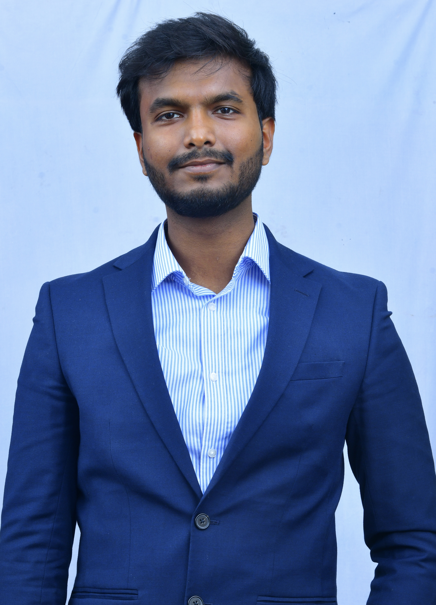

# CGI IT UK - Maritime Twin Innovate UK Project

The maritime sector accounts for approximately 3% of global greenhouse gas
emissions, projected to rise to up to 10% by 2050 without decisive intervention
(International Maritime Organization, 2020). The IMO have set ambitious targets
to reduce the carbon intensity of shipping by 40% by 2030 and total annual
emissions by at least 50% by 2050, creating an urgent need for innovative
solutions to meet these. Despite this, current approaches to vessel routing and
environmental impact assessment remain largely disconnected, reactive, and
suboptimal, relying on fragmented data sources that fail to provide a holistic view of vessel operations and their environmental consequences, leaving shipping
operators without capacity to make changes based on accurate/reliable.

With global trade expanding, the maritime sector faces mounting pressure to
adopt sustainable practices and comply with stringent regulatory standards,
evolving rapidly. The maritime industry has historically been slow to embrace
technological advancements. However, recent trends highlight a willingness bring in cutting-edge technologies i.e. artificial intelligence, the Internet of Things (IoT), and Satellite (Earth Observation) to optimize operations due to their proven ability to increase operational efficiency, reducing costs.

MaritimeTwin, a collaboration between CGI, Maritime Industries UK and IDRIC,
Heriot Watt University brings together world-class expertise in digital innovation, maritime research, and industry standards to develop an innovative digital twin combined satellite technology solution for route optimisation and environmentalimpact assessment in maritime shipping. This ground breaking approach is expected to contribute reduction of greenhouse gas emissions by 15-20%.

# [SEEDS](https://www.cgi.com/uk/en-gb/sustainability/sustainability-exploration-and-environmental-data-science-seeds) - The Center for Excellence - Geospatial, EO research 🏞️🌆🍃🌧☔🌍🌡️

The Sustainability Exploration Environmental Data Science (SEEDS) programme is an exciting research initiative to challenge the thinking and practice around sustainability. It will develop ground-breaking products and solutions, providing benefits for governments, businesses, and individuals.

Vision: Accelerating the transition to a sustainable future through technology, research, and innovation.

Mission: To harness the power of technology, research, and innovation to create positive environmental and social change, and foster access to technological sustainability solutions.

# Community Members ✨

Thanks go to these wonderful people: 🤝

<table>
  <tbody>
    <tr>
      <td align="center"><a href="https://www.linkedin.com/in/vardhan-raj-modi-0b10958a/"> <b>Raj Modi</b></a> <a href="#projectManagement-Kevin" title="Project Management">📆</a></td>
      <td align="center"><a href="https://www.linkedin.com/in/anandaraj-p/"> <b>Anandaraj Pandian</b></a> <a title="Code">💻</a></td>
      <td align="center"><a href="https://www.linkedin.com/in/dean-hull-32b4659b/"> <b>Dean Hull</b></a> <a title="Code">💻</a></td>      
  </tbody>
</table>
